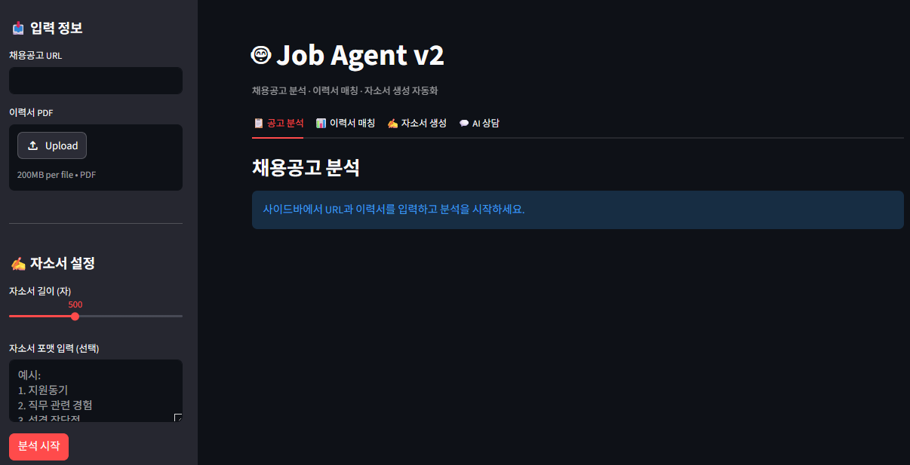
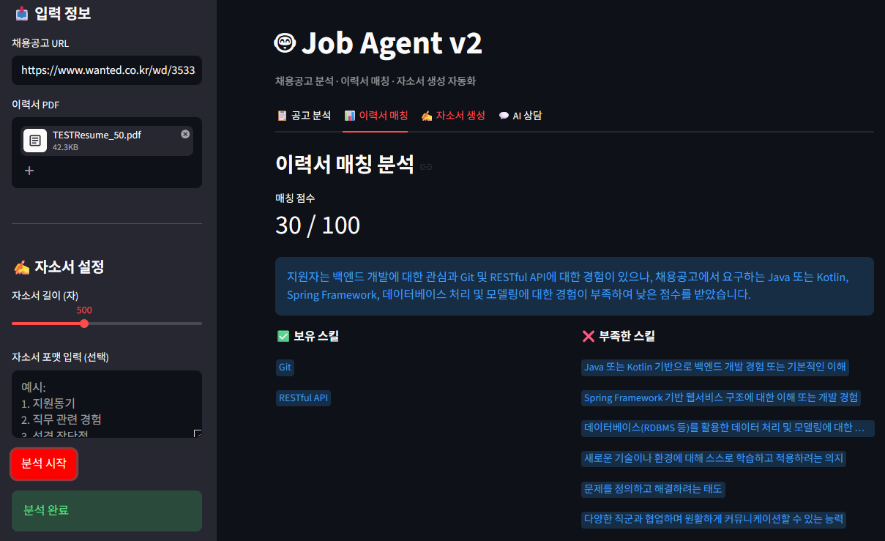
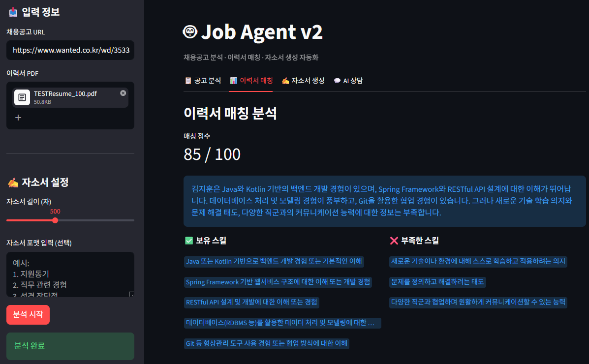
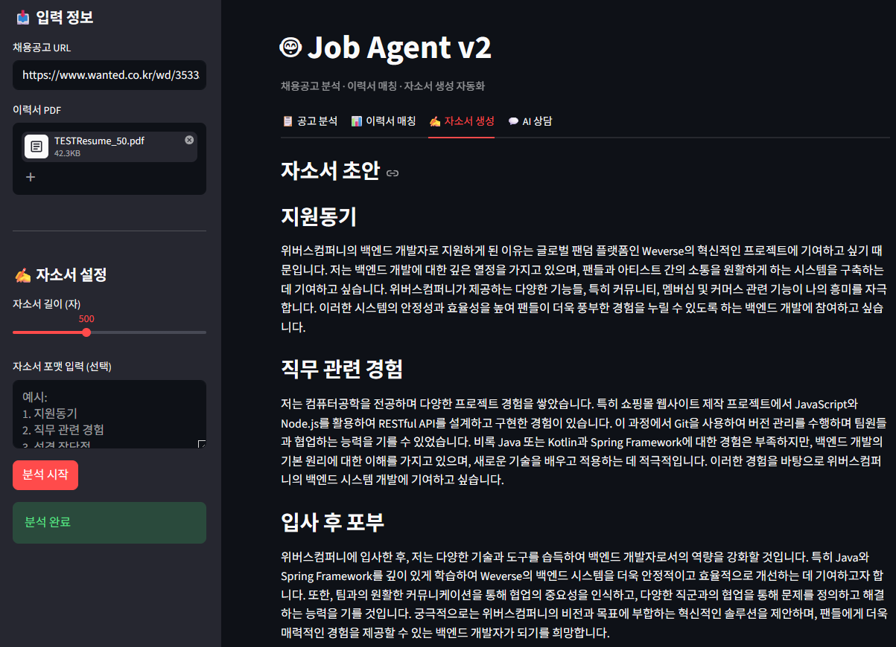
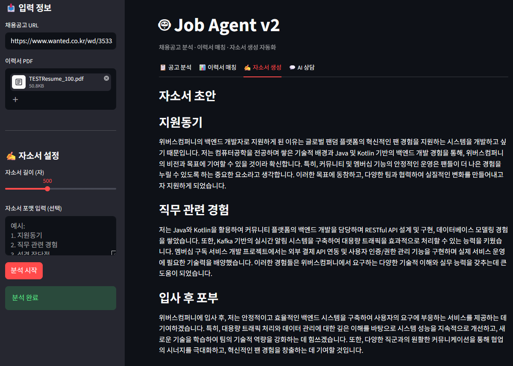
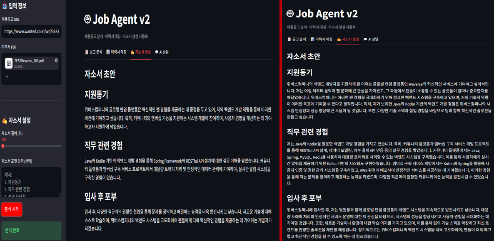
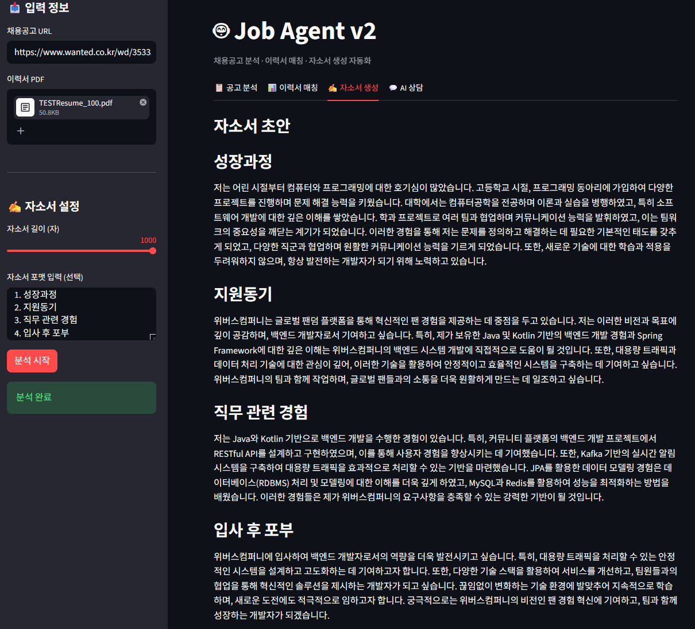
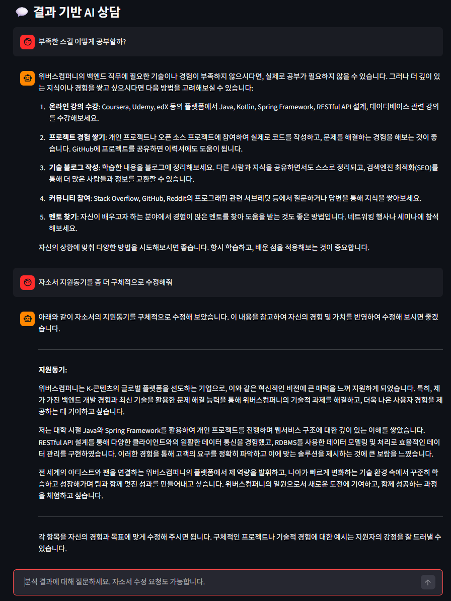

# 🤖 Job Agent v2 — AI 기반 채용공고 분석 Agent

> LangGraph 기반 채용공고 분석 · 이력서 매칭 · 자소서 생성 자동화 서비스 (v2)

🚀 라이브 데모: (배포 후 링크 추가 예정)

---

## v1에서 v2로 달라진 것

| | v1 | v2 |
|---|---|---|
| 입력 방식 | 탭마다 URL + 이력서 입력 | 사이드바에서 한 번만 입력 |
| 자소서 길이 | 200자 고정 | 200~1000자 슬라이더로 조절 |
| 자소서 포맷 | 지원동기/직무경험/입사후포부 고정 | 사용자 직접 입력 가능 |
| AI 상담 | 없음 | 분석 결과 기반 채팅 + 자소서 수정 요청 |
| 테스트 | 단일 이력서 | 30점/85점 이력서 비교 테스트 |

---

## 주요 기능

**1. 채용공고 분석**
채용공고 URL을 입력하면 웹 크롤링 후 GPT-4o-mini가 회사명, 직무, 필수 스킬, 우대사항, 경력 요건을 자동 추출합니다.

**2. 이력서 매칭**
이력서 PDF를 업로드하면 채용공고와 비교해서 보유 스킬, 부족한 스킬, 매칭 점수(0~100)를 산출합니다.

**3. 자소서 초안 생성**
이력서와 공고 분석 결과를 바탕으로 자소서 초안을 생성합니다. 길이와 포맷을 직접 설정할 수 있습니다.

**4. 결과 기반 AI 상담**
분석 결과를 바탕으로 GPT와 대화하며 부족한 스킬 학습 방법이나 자소서 수정을 요청할 수 있습니다.

---

## 기술 스택

| 분류 | 기술 |
|---|---|
| 언어 | Python 3.11 |
| LLM | GPT-4o-mini |
| Agent | LangGraph |
| 크롤링 | httpx, BeautifulSoup4 |
| PDF 파싱 | PyMuPDF (fitz) |
| UI | Streamlit |
| 배포 | Streamlit Cloud |

---

## 주요 화면

> 📌 아래 스크린샷은 위버스컴퍼니 백엔드 공고를 기준으로 테스트한 결과입니다.

### 1. 초기 화면 (사이드바 공통 입력)

v1에서는 탭마다 URL과 이력서를 입력해야 했지만, v2에서는 사이드바에서 한 번만 입력하면 모든 탭에 적용됩니다. 자소서 길이 슬라이더와 포맷 입력란도 사이드바에 통합했습니다.

---

### 2. 이력서 매칭 — 30점 (낮은 적합도)

Python, RESTful API, Git만 보유한 이력서는 Java/Kotlin, Spring 등 핵심 스킬이 부족해 30점을 받았습니다.

---

### 3. 이력서 매칭 — 85점 (높은 적합도)

Java, Kotlin, Spring, JPA, MySQL, Redis 등 공고 요구사항을 대부분 보유한 이력서는 85점을 받았습니다.

---

### 4. 자소서 생성 — 30점 이력서

부족한 스킬이 많더라도 이력서 내용을 최대한 활용해서 자소서 초안을 생성합니다.

---

### 5. 자소서 생성 — 85점 이력서

보유 스킬이 공고와 잘 맞을수록 더 구체적이고 설득력 있는 자소서가 생성됩니다.

---

### 6. 자소서 길이 조절 (200자 vs 1000자)

슬라이더로 자소서 길이를 조절할 수 있습니다. 왼쪽은 200자, 오른쪽은 1000자로 설정한 결과입니다. 길이에 따라 내용의 구체성과 분량이 달라집니다.

---

### 7. 자소서 포맷 커스터마이징

기업마다 다른 자소서 양식에 맞게 항목을 직접 입력할 수 있습니다. 성장과정, 지원동기, 직무 관련 경험, 입사 후 포부 4개 항목으로 설정한 결과입니다.

---

### 8. 결과 기반 AI 상담

분석 결과를 바탕으로 GPT와 대화할 수 있습니다. 부족한 스킬 공부 방법을 묻거나 자소서 수정을 요청하면 바로 반영된 결과를 받을 수 있습니다.

---

## 개발 과정

### v1 → v2 개선 배경

v1은 탭마다 URL과 이력서를 반복 입력해야 해서 UX가 불편했습니다. 또한 자소서가 200자로 고정되어 실제 활용이 어렵고, 결과를 보고 수정하려면 처음부터 다시 해야 하는 문제가 있었습니다.

이를 해결하기 위해 사이드바 공통 입력, 자소서 고도화, AI 상담 기능을 추가했습니다.

### 매칭 점수 비교 실험

동일한 공고에 대해 의도적으로 적합도가 다른 이력서 두 개를 만들어 테스트했습니다.

- 낮은 적합도 이력서: Python, RESTful API, Git만 보유 → **30점**
- 높은 적합도 이력서: Java, Kotlin, Spring, JPA, Redis 등 보유 → **85점**

점수 차이가 명확하게 나타나 매칭 로직이 공고 요구사항을 잘 반영하고 있음을 확인했습니다.

### 자소서 포맷 커스터마이징 구현 시 문제

처음에는 GPT가 JSON 키를 영어 snake_case로 변환해서 타이틀이 `growth`, `motivation` 같은 영어로 출력되는 문제가 있었습니다. 프롬프트에서 "항목명을 JSON 키로 그대로 사용하고 번호는 제거해줘"로 수정해서 한글 타이틀이 그대로 나오도록 해결했습니다.

---

## 설치 및 실행

```bash
# 1. 환경 설정
conda create -n job_agent_env python=3.11
conda activate job_agent_env
pip install -r requirements.txt

# 2. API 키 설정
# .env 파일 생성 후 입력
OPENAI_API_KEY=sk-...

# 3. Streamlit 실행
streamlit run frontend/app.py
```

---

## 개발 인사이트

**UX는 기능만큼 중요하다**
v1에서 탭마다 URL과 이력서를 반복 입력하는 구조는 기능적으로는 동작하지만 실제 사용하기엔 불편했습니다. 사이드바로 입력을 통합하는 작은 변화가 사용성을 크게 개선했습니다.

**프롬프트 설계가 결과 품질을 결정한다**
자소서 포맷 커스터마이징에서 JSON 키가 영어로 출력되는 문제를 겪었습니다. 코드 수정 없이 프롬프트만 바꿔서 해결했는데, 같은 모델이라도 프롬프트 설계에 따라 결과가 크게 달라진다는 걸 다시 확인했습니다.

**정량 비교의 중요성**
30점 vs 85점 이력서 비교 실험을 통해 매칭 로직이 실제로 공고 요구사항을 잘 반영하는지 수치로 확인할 수 있었습니다. 단순히 "잘 된다"가 아니라 수치로 보여줄 수 있어야 신뢰성이 생깁니다.

---

## v3 예정 기능

- 매칭 점수 일관성 개선 (텍스트 전처리 강화)
- 정량 평가 지표 추가
- 잡코리아 크롤링 개선
- 다중 공고 비교 기능

---

*이전 버전: [Job Agent v1](https://github.com/HyeonBin0118/job-agent)*