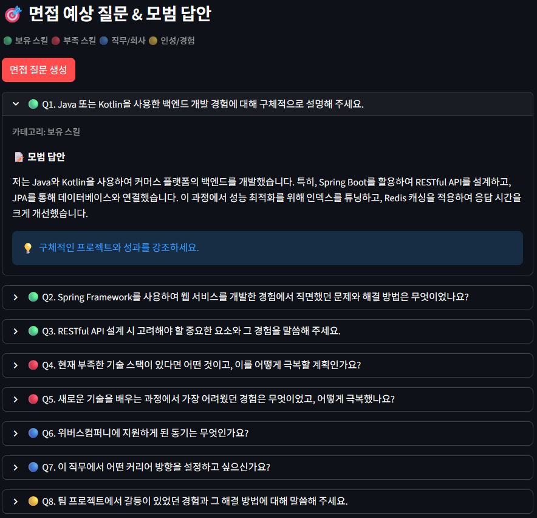
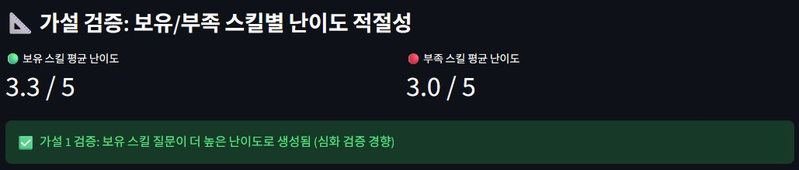
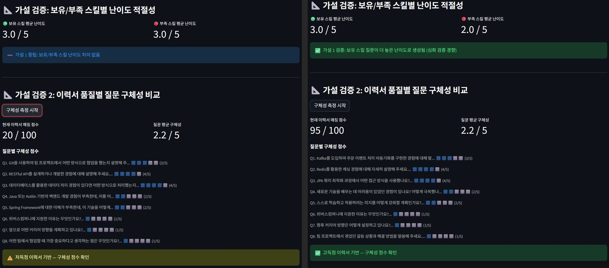

# 🤖 Job Agent v3 — AI 기반 채용공고 분석 Agent

> 텍스트 전처리 강화 · 정량 평가 · 자소서 품질 자동 평가 · 다중 공고 비교 · 면접 준비

🚀 **라이브 데모**: https://job-agent-v3-yzhg5h4dlyceriez67kudz.streamlit.app/

---

## v2에서 v3로 달라진 것

| | v2 | v3 |
|---|---|---|
| 크롤링 전처리 | 기본 태그 제거 | 광고/배너 클래스 제거 + 특수문자 정리 + 중복 줄 제거 |
| 정량 평가 | 없음 | 10회 반복 테스트 + 크롤링 텍스트 품질 비교 |
| 자소서 평가 | 없음 | 구체성/직무연관성/구조 자동 평가 |
| 공고 비교 | 단일 공고 | 최대 3개 공고 동시 비교 |
| 면접 준비 | 없음 | 예상 질문 + 모범 답안 + 난이도/구체성 가설 검증 |

---

## 주요 기능

**1. 채용공고 분석**
채용공고 URL을 입력하면 웹 크롤링 후 GPT-4o-mini가 회사명, 직무, 필수 스킬, 우대사항, 경력 요건을 자동 추출합니다.

**2. 이력서 매칭**
이력서 PDF를 업로드하면 채용공고와 비교해서 보유 스킬, 부족한 스킬, 매칭 점수(0~100)를 산출합니다.

**3. 자소서 초안 생성 + 품질 자동 평가**
자소서 초안을 생성한 뒤 구체성, 직무 연관성, 구조/논리성 세 가지 지표로 자동 평가하고 개선 피드백을 제공합니다.

**4. 결과 기반 AI 상담**
분석 결과를 바탕으로 GPT와 대화하며 부족한 스킬 학습 방법이나 자소서 수정을 요청할 수 있습니다.

**5. 다중 공고 비교**
이력서 하나로 최대 3개 공고를 동시에 분석하고 매칭 점수 순으로 정렬합니다.

**6. 면접 예상 질문 & 모범 답안**
이력서와 채용공고를 바탕으로 면접 질문 8개(보유 스킬 3 / 부족 스킬 2 / 직무·회사 2 / 인성 1)와 모범 답안을 자동 생성합니다. 질문별 난이도와 구체성 점수를 산출해 가설 검증에 활용합니다.

---

## 기술 스택

| 분류 | 기술 |
|---|---|
| 언어 | Python 3.11 |
| LLM | GPT-4o-mini (OpenAI API) |
| 크롤링 | httpx, BeautifulSoup4 |
| PDF 파싱 | PyMuPDF (fitz) |
| UI | Streamlit |
| 배포 | Streamlit Cloud |

---

## 주요 화면

> 📌 아래 스크린샷은 로컬 환경에서 원티드 공고로 테스트한 결과입니다.

### 1. 자소서 품질 자동 평가


> 자소서를 생성하면 구체성·직무 연관성·구조/논리성 세 항목을 0~10점으로 채점하고 한 줄 피드백을 제공합니다.

<br>

### 2. 다중 공고 비교


> 같은 이력서로 원티드 공고 3개를 동시에 분석한 결과입니다. 위버스컴퍼니 백엔드(95점), 비큐에이아이 백엔드(80점), 우알롱 패션디자이너(0점) 순으로 매칭 점수가 산출되어 직무 관련도가 점수에 반영됨을 확인할 수 있습니다.

<br>

### 3. 면접 예상 질문 & 모범 답안



> 질문을 카테고리별 색상(🟢 보유 스킬 / 🔴 부족 스킬 / 🔵 직무·회사 / 🟡 인성)으로 구분하고, 클릭하면 모범 답안과 답변 팁이 펼쳐집니다.

<br>

### 4. 가설 1 검증 결과



> 같은 공고·같은 이력서 기준으로 보유 스킬 질문 평균 난이도가 3.3, 부족 스킬 질문은 3.0으로 산출되었습니다.

<br>

### 5. 가설 2 검증 결과 (50점 vs 100점 이력서)



> 동일한 공고에 매칭 점수가 다른 두 이력서를 넣었습니다. 왼쪽은 매칭 20점 이력서, 오른쪽은 매칭 95점 이력서의 결과입니다. 구체성 수치는 2.2로 같지만 실제 질문 내용(Git/RESTful API vs Kafka/Redis/JPA)은 확연히 다릅니다.

---

## 실험 및 검증

### 1. 텍스트 전처리 효과 비교 (잡코리아 공고 기준)

v2에서 동일 입력에도 매칭 점수가 간헐적으로 달라지는 문제의 원인을 분석한 결과, GPT에 넘기는 크롤링 텍스트에 광고, 메뉴, 중복 줄 등 노이즈가 섞여 있었습니다. 잡코리아는 광고 배너, 추천 공고, 로그인 유도 문구 등이 페이지에 많이 포함되어 크롤링 노이즈가 특히 많습니다. 이를 기준으로 전처리 효과를 검증했습니다.

| 항목 | v2 전처리 | v3 전처리 | 개선 |
|---|---|---|---|
| 총 문자 수 | 679자 | 282자 | 58% 감소 |
| 총 줄 수 | 75줄 | 27줄 | 64% 감소 |
| 노이즈 줄 수 | 1줄 | 0줄 | 100% 제거 |
| 노이즈 비율 | 1.3% | 0.0% | — |

> 광고/배너 클래스 제거, 특수문자 정리, 중복 줄 제거가 적용되어 GPT에 넘어가는 텍스트가 절반 이하로 줄었습니다.

<br>

### 2. 매칭 점수 일관성 실험 — 예상과 다른 결과

v2에서 동일 입력에도 매칭 점수가 33점/67점으로 간헐적으로 달라지는 문제를 발견했습니다. `temperature=0`으로 설정했음에도 크롤링 노이즈가 원인일 것으로 가정하고 v3에서 전처리를 강화해 10회 반복 테스트를 진행했습니다.

| | v2 전처리 | v3 전처리 |
|---|---|---|
| 낮은 이력서 평균 | 0점 (편차 0) | 10점 (편차 20) |
| 높은 이력서 평균 | 100점 (편차 0) | 100점 (편차 0) |

`temperature=0` 환경에서는 GPT 응답이 고정되어 전처리 전후 점수 변화로 일관성을 비교하기 어렵다는 한계를 발견했습니다. v2에서 점수가 달라진 원인은 노이즈로 인한 공고 해석 차이였으며, 전처리 품질 개선은 위 크롤링 텍스트 비교 수치로 확인했습니다.

<br>

### 3. 프롬프트 실험 (A vs B)

기본 프롬프트와 STAR 기법 프롬프트를 비교했습니다.

| 항목 | 프롬프트 A (기본) | 프롬프트 B (STAR) |
|---|---|---|
| 구체성 | 7/10 | 8/10 |
| 직무 연관성 | 9/10 | 9/10 |
| 구조/논리성 | 8/10 | 8/10 |
| 총점 | 24/30 | 25/30 |

총점 차이는 1점으로 통계적으로 유의미하지 않았습니다. GPT-4o-mini 수준에서는 프롬프트 구조보다 입력 데이터 품질이 결과에 더 큰 영향을 미친다고 판단됩니다. 다만 자소서를 세 가지 지표로 자동 평가하는 파이프라인을 구축했다는 점에 의의가 있습니다.

> **STAR 기법**
> - **S**ituation (상황): 어떤 상황이었는지
> - **T**ask (과제): 무엇을 해야 했는지
> - **A**ction (행동): 내가 어떻게 했는지
> - **R**esult (결과): 어떤 결과가 나왔는지

<br>

### 4. 면접 질문 품질 가설 검증

#### 가설 1 — 보유 스킬 질문이 부족 스킬 질문보다 난이도가 높을 것이다

보유 스킬은 실제 경험이 있으므로 GPT가 심화 검증 질문을, 부족 스킬은 극복 방안을 묻는 상대적으로 단순한 질문을 생성할 것이라는 가설입니다.

| 항목 | 평균 난이도 |
|---|---|
| 보유 스킬 질문 | 3.3 / 5 |
| 부족 스킬 질문 | 3.0 / 5 |

✅ **검증됨.** 보유 스킬에는 구체적인 활용 사례와 트레이드오프를 묻는 심화 질문이, 부족 스킬에는 학습 계획이나 극복 의지를 묻는 상대적으로 낮은 난이도의 질문이 생성되는 경향이 확인되었습니다.

<br>

#### 가설 2 — 고품질 이력서일수록 더 구체적인 면접 질문이 생성될 것이다

매칭 20점(저품질) 이력서와 매칭 95점(고품질) 이력서를 각각 입력했을 때 질문 구체성을 비교했습니다. 초기에는 GPT 자체 평가 방식을 사용했으나 두 이력서 모두 3.0으로 동일하게 산출되어, **질문 텍스트가 이력서의 실제 키워드(기술명·프로젝트명·수치)를 얼마나 반영하는지**로 측정 방식을 바꿨습니다.

| 항목 | 매칭 점수 | 질문 구체성 |
|---|---|---|
| 저품질 이력서 | 20 / 100 | 2.2 / 5 |
| 고품질 이력서 | 95 / 100 | 2.2 / 5 |

⚠️ **수치는 같지만 질문 내용은 확연히 달랐습니다.**

- 저품질 이력서 → *"Git을 사용하여 팀 프로젝트에서 어떤 방식으로 협업했는지 설명해 주세요"* 같은 범용 질문
- 고품질 이력서 → *"Kafka를 도입하여 주문 이벤트 처리 비동기화를 구현한 경험에 대해 말씀해 주세요"* 같은 프로젝트 기반 심화 질문

키워드 등장 빈도만으로는 이 차이가 잡히지 않았습니다. **질문의 도메인 깊이**가 구체성의 더 유의미한 지표라는 점을 확인한 반증 사례로 남겼습니다.

---

## 프로젝트 구조

```
job-agent-v3/
├── frontend/
│   └── app.py               # Streamlit UI (전체 로직 포함)
├── evaluation/
│   ├── run_eval.py          # v3 전처리 매칭 점수 10회 반복 테스트
│   ├── run_eval_v2.py       # v2 전처리 비교용
│   ├── compare_crawl.py     # 크롤링 텍스트 품질 비교
│   └── prompt_eval.py       # 프롬프트 A/B 자소서 품질 비교
├── images/                  # 스크린샷
├── .env                     # API 키 (gitignore)
└── requirements.txt
```

---

## 설치 및 실행

```bash
# 1. 환경 설정
conda create -n job_agent_env python=3.11
conda activate job_agent_env
pip install -r requirements.txt

# 2. API 키 설정 (.env)
OPENAI_API_KEY=sk-...

# 3. Streamlit 실행
streamlit run frontend/app.py

# 4. 정량 평가 실행
python evaluation/run_eval.py
python evaluation/compare_crawl.py
python evaluation/prompt_eval.py
```

---

## 개발 기록

#### 크롤링 노이즈가 GPT 해석을 흔들었다
v2에서 동일 공고·동일 이력서로 매칭 점수가 33점과 67점을 오갔습니다. 원인을 추적하다 보니 크롤링 텍스트 안에 광고 배너, 로그인 유도 문구, 중복 줄이 함께 섞여 들어가고 있었고, 이 텍스트를 받은 GPT가 매번 다른 부분에 주목해 서로 다른 매칭 점수를 내놓고 있었습니다. v3에서 광고/메뉴 클래스 제거·특수문자 정리·중복 줄 제거를 추가해 입력 텍스트를 58% 줄이자 이 문제가 사라졌습니다.

#### 실패한 가설 2는 측정 방식의 문제였다
면접 질문 구체성이 이력서 품질에 따라 달라지는지 검증하려 했는데, 처음엔 GPT에게 직접 점수를 매기게 했더니 두 이력서 모두 3.0이 나왔습니다. 측정 방식을 "이력서 키워드가 질문에 등장하는가"로 바꿨지만 결과는 여전히 2.2 동률이었습니다. 다만 질문 내용 자체는 (Git → Kafka/Redis로) 완전히 달랐습니다. **"무엇을 측정할 것인가"를 잘못 설정하면 차이가 있어도 차이가 없는 것처럼 보인다**는 것을 직접 확인한 기록입니다.

#### GPT가 GPT를 평가하는 구조의 한계
자소서 품질 평가에서 프롬프트 A와 B의 점수 차이가 단 1점이었습니다. 생성자도 GPT-4o-mini, 평가자도 GPT-4o-mini인 환경에서 차이를 변별해내기 어려웠던 것으로 추정합니다. 후속 버전에서는 사람 평가나 서로 다른 모델 간 교차 평가를 고려할 필요가 있습니다.

---

## 배포 이슈

**잡코리아 크롤링 차단** — Streamlit Cloud 서버 IP가 잡코리아에서 차단되어 배포 환경에서는 동작하지 않습니다. 로컬에서는 정상 동작합니다. 정량 평가는 잡코리아 공고로, 배포 데모는 원티드로 진행했습니다.

---

*이전 버전: [Job Agent v2](https://github.com/HyeonBin0118/job-agent-v2)*