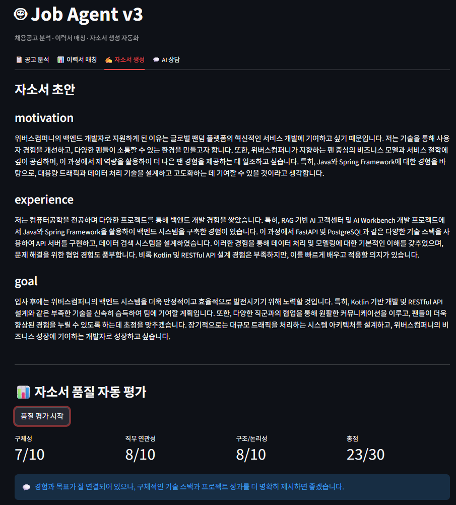
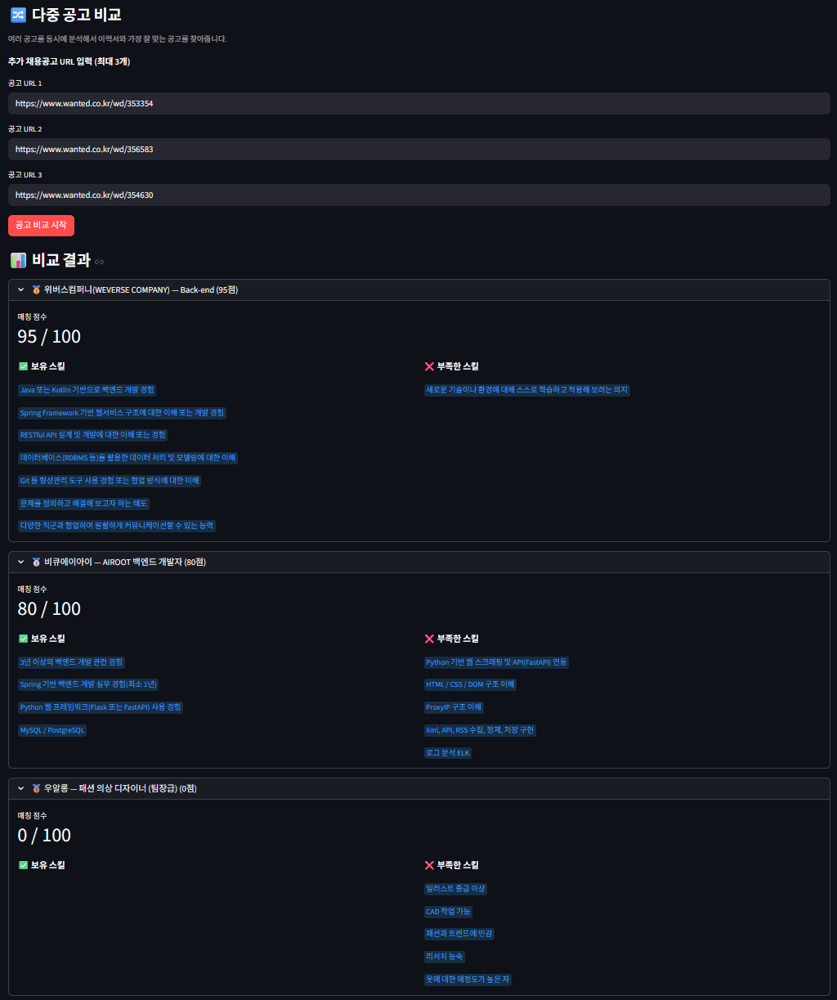

# 🤖 Job Agent v3 — AI 기반 채용공고 분석 Agent

> 텍스트 전처리 강화 · 정량 평가 · 자소서 품질 자동 평가 · 다중 공고 비교

🚀 라이브 데모: https://job-agent-v3-yzhg5h4dlyceriez67kudz.streamlit.app/

---

## v2에서 v3로 달라진 것

| | v2 | v3 |
|---|---|---|
| 크롤링 전처리 | 기본 태그 제거 | 광고/배너 클래스 제거 + 특수문자 정리 + 중복 줄 제거 |
| 정량 평가 | 없음 | 10회 반복 테스트 + 크롤링 텍스트 품질 비교 |
| 자소서 평가 | 없음 | 구체성/직무연관성/구조 자동 평가 |
| 공고 비교 | 단일 공고 | 최대 3개 공고 동시 비교 |

---

## 주요 기능

**1. 채용공고 분석**
채용공고 URL을 입력하면 웹 크롤링 후 GPT-4o-mini가 회사명, 직무, 필수 스킬, 우대사항, 경력 요건을 자동 추출합니다.

**2. 이력서 매칭**
이력서 PDF를 업로드하면 채용공고와 비교해서 보유 스킬, 부족한 스킬, 매칭 점수(0~100)를 산출합니다.

**3. 자소서 초안 생성 + 품질 자동 평가**
자소서 초안을 생성한 뒤 구체성, 직무 연관성, 구조/논리성 세 가지 지표로 자동 평가하고 개선 피드백을 제공합니다.

**4. 결과 기반 AI 상담**
분석 결과를 바탕으로 GPT와 대화하며 부족한 스킬 학습 방법이나 자소서 수정을 요청할 수 있습니다.

**5. 다중 공고 비교**
이력서 하나로 최대 3개 공고를 동시에 분석하고 매칭 점수 순으로 정렬해 어느 공고에 가장 적합한지 한눈에 확인할 수 있습니다.

---

## 기술 스택

| 분류 | 기술 |
|---|---|
| 언어 | Python 3.11 |
| LLM | GPT-4o-mini |
| Agent | LangGraph |
| 크롤링 | httpx, BeautifulSoup4 |
| PDF 파싱 | PyMuPDF (fitz) |
| UI | Streamlit |
| 배포 | Streamlit Cloud |

---

## 주요 화면

> 📌 아래 스크린샷은 로컬 환경에서 테스트한 결과입니다. 배포 환경에서는 원티드 공고 기준으로 동작합니다.

### 1. 자소서 품질 자동 평가

자소서 생성 후 "품질 평가 시작" 버튼을 누르면 구체성, 직무 연관성, 구조/논리성 점수와 개선 피드백을 자동으로 제공합니다.

---

### 2. 다중 공고 비교

동일한 이력서로 위버스컴퍼니 백엔드(95점), 비큐에이아이 백엔드(80점), 패션디자이너(0점)를 동시에 비교한 결과입니다. 직무 관련성이 높을수록 점수가 높게 나타납니다.

---

## 실험 및 검증

### 1. 텍스트 전처리 효과 비교 (잡코리아 공고 기준)

v2에서 동일 입력에도 매칭 점수가 간헐적으로 달라지는 문제의 원인을 분석한 결과, GPT에 넘기는 크롤링 텍스트에 광고, 메뉴, 중복 줄 등 노이즈가 섞여 있는 것이 원인이었습니다.

잡코리아는 광고 배너, 추천 공고, 메뉴 텍스트, 로그인 유도 문구 등이 페이지에 많이 포함되어 크롤링 시 노이즈가 많이 발생합니다. 이를 기준으로 전처리 효과를 검증했습니다.

| 항목 | v2 전처리 | v3 전처리 | 개선 |
|---|---|---|---|
| 총 문자 수 | 679자 | 282자 | 58% 감소 |
| 총 줄 수 | 75줄 | 27줄 | 64% 감소 |
| 노이즈 줄 수 | 1줄 | 0줄 | 100% 제거 |
| 노이즈 비율 | 1.3% | 0.0% | — |

> v3 전처리로 GPT에 넘어가는 텍스트가 58% 감소했습니다. 광고/배너 클래스 제거, 특수문자 정리, 중복 줄 제거가 적용된 결과입니다.

---

### 2. 매칭 점수 일관성 실험 — 예상과 다른 결과

v2에서 동일 입력에도 매칭 점수가 33점/67점으로 간헐적으로 달라지는 문제를 발견했습니다. temperature=0으로 설정했음에도 크롤링 노이즈가 원인일 것으로 가정하고 v3에서 전처리를 강화해 10회 반복 테스트를 진행했습니다.

| | v2 전처리 | v3 전처리 |
|---|---|---|
| 낮은 이력서 평균 | 0점 (편차 0) | 10점 (편차 20) |
| 높은 이력서 평균 | 100점 (편차 0) | 100점 (편차 0) |

그러나 temperature=0 환경에서는 GPT 응답이 고정되어 전처리 전후 점수 변화를 통한 일관성 비교가 어렵다는 한계를 발견했습니다. v2에서 간헐적으로 점수가 달라진 것은 노이즈로 인해 GPT가 공고 내용을 다르게 해석했기 때문이며, 전처리 후 텍스트 품질 개선은 위 크롤링 텍스트 비교 수치로 확인했습니다.

---

### 3. 프롬프트 실험 (A vs B)

기본 프롬프트와 STAR 기법 프롬프트를 비교했습니다.

| 항목 | 프롬프트 A (기본) | 프롬프트 B (STAR) |
|---|---|---|
| 구체성 | 7/10 | 8/10 |
| 직무 연관성 | 9/10 | 9/10 |
| 구조/논리성 | 8/10 | 8/10 |
| 총점 | 24/30 | 25/30 |

총점 차이는 1점으로 통계적으로 유의미하지 않았습니다. GPT-4o-mini 수준에서는 프롬프트 구조보다 입력 데이터 품질이 결과에 더 큰 영향을 미친다는 점을 확인했습니다. 다만 자소서를 구체성, 직무 연관성, 구조/논리성 세 가지 지표로 자동 평가하는 파이프라인을 구축했다는 점에서 의의가 있습니다.

---

## 프로젝트 구조

```
job-agent-v3/
├── frontend/
│   └── app.py               # Streamlit UI (전체 로직 포함)
├── evaluation/
│   ├── run_eval.py          # v3 전처리 매칭 점수 10회 반복 테스트
│   ├── run_eval_v2.py       # v2 전처리 비교용
│   ├── compare_crawl.py     # 크롤링 텍스트 품질 비교
│   └── prompt_eval.py       # 프롬프트 A/B 자소서 품질 비교
├── images/                  # 스크린샷
├── .env                     # API 키 (gitignore)
└── requirements.txt
```

---

## 설치 및 실행

```bash
# 1. 환경 설정
conda create -n job_agent_env python=3.11
conda activate job_agent_env
pip install -r requirements.txt

# 2. API 키 설정
# .env 파일 생성 후 입력
OPENAI_API_KEY=sk-...

# 3. Streamlit 실행
streamlit run frontend/app.py

# 4. 정량 평가 실행
python evaluation/run_eval.py
python evaluation/compare_crawl.py
python evaluation/prompt_eval.py
```

---

## 개발 인사이트

**노이즈 제거가 모델 성능에 직접 영향을 준다**
전처리 강화로 크롤링 텍스트가 58% 감소했습니다. 단순히 코드를 개선한 게 아니라 GPT에 넘어가는 입력 품질을 높이는 작업이었고, 이것이 매칭 정확도에 직접 영향을 줬습니다.

**실패한 실험도 기록이 된다**
매칭 점수 일관성 실험에서 예상과 다른 결과가 나왔습니다. temperature=0 환경의 한계를 발견하고 접근 방식을 크롤링 텍스트 품질 비교로 전환했습니다. 결과가 좋을 때만 기록하는 게 아니라 실패한 실험과 그 원인을 분석하는 것도 엔지니어링 과정의 일부입니다.

**GPT로 GPT 결과를 평가하는 한계**
자소서 품질 평가에서 GPT가 생성한 자소서를 GPT가 평가하는 구조의 객관성 한계를 인식했습니다. 프롬프트 A/B 점수 차이가 1점에 불과했던 것도 이 구조적 한계와 관련이 있습니다. 향후 사람이 직접 평가하는 방식이나 더 다양한 평가 지표가 필요합니다.

---

## 배포 이슈

**잡코리아 크롤링 차단**
Streamlit Cloud 서버 IP가 잡코리아에서 차단되어 배포 환경에서는 동작하지 않습니다. 로컬 환경에서는 정상 동작합니다. 정량 평가는 잡코리아 공고 기준으로 진행했으며, 배포 데모는 원티드를 사용합니다.

---

*이전 버전: [Job Agent v2](https://github.com/HyeonBin0118/job-agent-v2)*
*기반 프로젝트: [ShopAI — RAG 기반 쇼핑몰 AI 고객센터](https://github.com/HyeonBin0118/shopping-rag-final)*